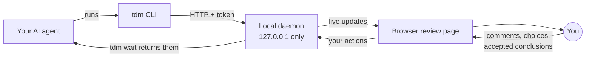

<h1 align="center">Tandem</h1>

<p align="center"><b>Review large AI output with your agent, thread by thread, in your browser.</b></p>

<p align="center">
  
  
</p>

<p align="center">
  <a href="#quickstart">Quickstart</a> •
  <a href="#how-it-works">How it works</a> •
  <a href="#installation">Installation</a> •
  <a href="#cli-reference">CLI reference</a> •
  <a href="#development">Development</a>
</p>

<!-- TODO: add demo GIF of the browser UI here (a stage advancing, a line comment, a variant picked, a conclusion accepted), recorded reproducibly, with alt text and width="800". -->

Tandem is a local review page that your AI coding agent drives for you. It is for developers who use an
agent like Claude Code and want to work through its code reviews, plans and documents properly instead of
scrolling a terminal.

AI output is long, flat and hard to read in a terminal. It rarely explains *why*, gives you no easy way to
compare options, and doesn't break into pieces you can decide on one at a time. With Tandem, the agent splits
the topic into **stages** and **threads** and posts notes, code, file excerpts and options to a page in your
browser. You comment on specific lines, pick variants and accept conclusions. The accepted stage summaries
become a short decision document.

> [!NOTE]
> Tandem is early and pre-release: there are no tagged releases yet, it runs on macOS and Linux only, and it
> has been built and tested with Claude Code. Expect the CLI and on-disk format to change.

## Features

- **Stage-by-stage, thread-by-thread.** Big topics are broken into stages, and each stage into threads that
  end in a conclusion you accept.
- **Line comments, batched.** Select lines or any text, write comments, then send them all at once with
  **Send to AI · N**. Drafts survive page reloads and daemon restarts.
- **Real file snapshots with diffs.** File blocks keep real line numbers, show a diff against git `HEAD`, and
  open the file at that line in your editor (Cursor, VS Code, Zed, Sublime Text, IntelliJ IDEA, GoLand, WebStorm).
- **Compare options.** The agent can post variants with pros and cons. You pick one, or reject all with a reason.
- **Quick questions.** The agent can ask a question with 2–4 answer buttons, and you can also write your own answer.
- **Live progress.** Background commands appear as live cards, and the page updates as the agent replies.
- **A decision document at the end.** `tdm export` (or **Export** in the page) gives you the session title
  plus the accepted stage summaries, with no code or chat.
- **Local and self-contained.** A single Go binary is both the CLI and a localhost-only daemon, with the web UI embedded.

## Quickstart

You need Go and git, on macOS or Linux. See [Installation](#installation) for details.

1. Build and install `tdm`:

   ```bash
   git clone https://github.com/lukFisz/tandem && cd tandem && ./install.sh
   ```

2. Install the Claude Code skill (writes `~/.claude/skills/tandem/SKILL.md`):

   ```bash
   tdm skill install
   ```

3. In Claude Code, ask the agent to **"review this with Tandem"**. It reads `tdm guide`, starts a session,
   and your browser opens on the review page.

You don't run `tdm` yourself in normal use. The agent runs it. Other agents can follow the same protocol if
you point them at `tdm guide`, but only Claude Code has been tested.

## How it works



1. The agent runs `tdm` commands. The first command starts a background daemon automatically.
2. The daemon stores the session and serves the review page on `127.0.0.1`, and your browser opens on it.
3. The agent posts content and then blocks on `tdm wait`.
4. You read, comment and decide in the browser. `tdm wait` returns your actions to the agent, and it responds.
5. When every thread in a stage is resolved, the agent proposes a stage summary for you to accept. The
   accepted summaries make up the decision document.

Here is what the agent's side looks like (real output, token shortened):

```console
$ tdm session new "Review the auth refactor"
s_73f640 http://127.0.0.1:44139/s/s_73f640?token=24f6…
$ tdm stage add "Token handling" --goal "Agree on token storage"
st_1
$ tdm thread add "Where should the token live?"
t_1
$ tdm ask "Keep the 30-minute idle timeout?" --option Yes --option No
q_1 o_1 o_2
$ tdm wait
```

### Core concepts

| Concept | ID | What it is |
|---|---|---|
| Session | `s_xxxxxx` | One topic, such as "Review the auth refactor". Each project (git root, or the current directory) has one active session. Closed sessions are read-only. |
| Stage | `st_N` | A phase of a session, with an optional goal. Ends with a **stage summary** you accept. |
| Thread | `t_N` | One question or piece of a stage. Ends with a **conclusion** you accept, or you resolve it yourself. |
| Block | `b_N` | Content in a thread: `note`, `code`, `file`, `markdown` or `variants`. A newer block can supersede an older one. |
| Variant | `o_N` | One option in a `variants` block, with a title, description, pros and cons. |
| Annotation | | An agent note attached to specific lines of a code, file or markdown block. |
| Question | `q_N` | A quick question with 2–4 answer buttons. Answering never resolves the thread. |
| Process | `p_N` | A background command shown as a live card in a thread. |
| Conclusion | | The agent's proposed outcome of a thread. You accept it, edit it, or ask to discuss further. |
| Decision document | | The output of `tdm export`: the session title plus accepted stage summaries. |

### Keyboard shortcuts

| Key | Action |
|---|---|
| <kbd>j</kbd> / <kbd>k</kbd> | Next / previous thread or stage |
| <kbd>c</kbd> | Comment on the selected text or lines. With nothing selected on an open thread, add a note and resolve it. |
| <kbd>a</kbd> | Accept the proposed conclusion |
| <kbd>Esc</kbd> | Clear the selection |
| <kbd>⌘</kbd><kbd>↵</kbd> / <kbd>Ctrl</kbd><kbd>↵</kbd> | Send (composer, comments, variant choice, text notes) |

Click or shift-click line numbers to select a range. Shortcuts are ignored while you are typing.

## Installation

**Requirements**

- macOS or Linux. Windows is not supported (the build fails there).
- Go 1.27, as set in `go.mod`. An older Go toolchain (1.21 or later) downloads 1.27 automatically.
- git is optional. Tandem uses it to identify the project and to diff files, and falls back to the current directory without it.
- A web browser. Tandem opens it with `open` on macOS and `xdg-open` on Linux.

**With the install script** (recommended). From a clone, this builds `tdm` and installs it to
`/usr/local/bin`, using `sudo` only if that directory isn't writable. Set `PREFIX` to install somewhere else:

```bash
git clone https://github.com/lukFisz/tandem
cd tandem
./install.sh                     # installs /usr/local/bin/tdm
PREFIX="$HOME/.local/bin" ./install.sh
```

Re-running it is safe. The binary is only replaced when the build output changes, and the script warns you if `PREFIX` is not on your `PATH`.

**With `go build`.** The web UI's build output is committed, so you don't need Node:

```bash
go build -o ~/bin/tdm ./cmd/tdm   # ~/bin must exist and be on your PATH
```

Local builds report a version like `dev-19e9513b16a8`. To stamp one, use `go build -ldflags "-X main.version=v0.1.0" ./cmd/tdm`.

**Agent setup.** For Claude Code, run `tdm skill install` (use `--dir` to choose another location). For
other agents, tell them to run `tdm guide` and follow it.

## CLI reference

The agent runs these commands. `tdm guide` prints the full protocol, and `tdm <command> --help` shows every flag.

| Command | Purpose |
|---|---|
| `tdm session new\|list\|use\|show\|close` | Create, list, switch, inspect and close sessions |
| `tdm open` | Reopen the current session in the browser |
| `tdm stage add\|summarize\|propose` | Add stages and propose stage summaries |
| `tdm thread add` | Add a thread to a stage |
| `tdm block add note\|code\|file\|markdown\|variants` | Post content to a thread |
| `tdm annotate`, `tdm say`, `tdm ask`, `tdm conclude` | Annotate lines, chat, ask a question, propose a conclusion |
| `tdm process run\|start\|end` | Show a background command as a live card |
| `tdm wait` | Block until you act (exit code 3 on timeout) |
| `tdm log`, `tdm export` | Raw events as JSON lines, and the decision document |
| `tdm daemon status\|stop` | Inspect or stop the background daemon |
| `tdm guide`, `tdm skill install` | Print the agent protocol, and install the Claude Code skill |

<details>
<summary>All commands and flags</summary>

Global flags: `--json` (JSON output), `--session <id>` (default: `$TANDEM_SESSION`, then the project's active session), `-v, --version`, `-h, --help`.

| Command | Flags | Notes |
|---|---|---|
| `tdm session new <title>` | `--no-open` | Makes it active and opens the browser. Prints `s_xxx <url>`. |
| `tdm session list` | | `*` marks the active session |
| `tdm session use <session-id>` | | Set the project's active session |
| `tdm session show` | | Stages, threads, open questions and what is awaiting the agent |
| `tdm session close` | | The session becomes read-only |
| `tdm open` | | |
| `tdm stage add <title>` | `--goal` | Prints `st_N` |
| `tdm stage summarize` | `--stage` | Prints thread conclusions as input for a summary |
| `tdm stage propose [summary]` | `--stage` | Summary from the argument or stdin |
| `tdm thread add <title>` | `--stage` | Default: latest open stage. Prints `t_N`. |
| `tdm block add note` | `--text` or stdin | |
| `tdm block add code` | `--lang`, `--text` or stdin | |
| `tdm block add file` | `--path`, `--lines N\|N-M` | Text files inside the project, up to 1 MiB |
| `tdm block add markdown` | `--path` or stdin, `--lines` | |
| `tdm block add variants` | `--input -` | JSON on stdin, 2+ options. Prints `b_N o_1 o_2 …`. |
| all `block add` | `--thread`, `--supersedes b_M` | Default: latest open thread |
| `tdm annotate <block-id> <text>` | `--lines N\|N-M` | |
| `tdm say [text]` | `--thread`, `--stage` | |
| `tdm ask [question]` | `--option` (2–4×), `--thread`, `--stage`, `--withdraw q_N` | Prints `q_N o_N …` |
| `tdm conclude [text]` | `--thread` | |
| `tdm process run --out <path> -- <cmd> [args…]` | `--out`, `--thread` | Records the exit code |
| `tdm process start` | `--pid`, `--cmd`, `--out`, `--thread` | Attach a process you started |
| `tdm process end <id>` | `--exit` | |
| `tdm wait` | `--timeout` (default `9m0s`) | |
| `tdm log` | `--since N`, `--stage` | |
| `tdm export` | `--stage`, `--out` | |
| `tdm daemon status` / `stop` | | |
| `tdm guide` | | |
| `tdm skill install` | `--dir` (default `~/.claude/skills/tandem`) | |

Exit codes: `0` ok, `1` error, `2` usage, `3` `wait` timeout. Errors go to stderr as `error: <code>: <message>` plus a `hint:` line, or as `{"error":{...}}` with `--json`.

</details>

## Configuration

| Variable | Default | Effect |
|---|---|---|
| `TANDEM_HOME` | `~/.tandem` | Where all state lives |
| `TANDEM_SESSION` | project's active session | Session to act on (same as `--session`) |
| `TANDEM_NO_BROWSER` | unset | If set, don't launch a browser |
| `TANDEM_IDLE_TIMEOUT` | `30m` | Daemon idle shutdown, as a Go duration (`10m`, `2h`) |

Files under `$TANDEM_HOME`. Files are created with mode `0600` and directories with `0700`.

```text
daemon.json        port, pid, version, token (removed on clean shutdown)
daemon.port        last port, reused so the page's origin and drafts survive restarts
daemon.log         daemon output
daemon.lock, start.lock
settings.json      your editor choice
projects/<projectId>/project.json
projects/<projectId>/sessions/<sid>/events.jsonl    append-only event log
projects/<projectId>/sessions/<sid>/blobs/<sha256>  file snapshots and diffs
```

The daemon starts on demand and exits after the idle timeout with no requests. If you rebuild `tdm`, the
next command replaces a running daemon whose version differs.

## Security model

Your actions in the page drive an agent that runs commands, so a forged action would amount to prompt
injection. The daemon guards against this:

- It binds to `127.0.0.1` only, on the previous port if it is free and otherwise on a random one.
- Every daemon start generates a new random token (32 bytes). It is stored in `daemon.json` with mode `0600`.
- The CLI sends the token as `Authorization: Bearer`. The browser receives it once in the session URL,
  exchanges it for an `HttpOnly`, `SameSite=Strict` cookie, and is redirected to strip it from the URL.
  `tdm wait` accepts only the Bearer token.
- Requests must carry a `Host` of `127.0.0.1:<port>` or `localhost:<port>` (DNS-rebinding defense). Non-GET
  requests with a mismatched `Origin` are rejected, and so are cookie requests marked `same-site` or `cross-site`.
- Tokens are compared in constant time, and request bodies are capped at 8 MiB.

There is no `SECURITY.md` yet. If you find a vulnerability, please contact the maintainer privately instead of opening a public issue.

## Development

```bash
go test ./...                                                # Go unit tests and end-to-end CLI tests
cd web && npm install && npm test                            # web UI tests (Vitest)
go test ./internal/daemon -run TestSnapshotContractFixture -update   # regenerate the shared snapshot fixture
```

The web UI lives in `web/` (React, TypeScript, Vite) and needs Node 22.12 or later. Its build output,
`internal/daemon/webdist/`, is committed. Run `npm run build` and commit the result whenever you change the UI.
`npm run dev` proxies a fixed allow-list of `/api` requests to the running daemon. See
[docs/DEVELOPMENT.md](docs/DEVELOPMENT.md) for the full workflow, the dev proxy rules, Playwright e2e and known test caveats.

Design specs and implementation plans are in [`docs/superpowers/specs/`](docs/superpowers/specs/) and
[`docs/superpowers/plans/`](docs/superpowers/plans/), and the roadmap is in [`docs/ROADMAP.md`](docs/ROADMAP.md).

## Project status

Tandem is an early personal tool being prepared for its first public, single-user open-source release. There
are no releases, tags or prebuilt binaries yet, and no CI. `go install` does not work yet because the module path
(`github.com/lukaszfiszer/tandem`) doesn't match the repository URL. Homebrew and npm packaging are planned
(see the [roadmap](docs/ROADMAP.md)). Only Claude Code has been tested as the driving agent.

## Contributing

The project is early. Please open an issue at [github.com/lukFisz/tandem](https://github.com/lukFisz/tandem) to discuss a change before
sending a larger pull request.
Before opening a PR, run `go test ./...` and, for UI changes, `npm test` and `npm run build` in `web/`.
[docs/DEVELOPMENT.md](docs/DEVELOPMENT.md) covers the setup.

## License

No license has been chosen yet. Until one is added, all rights are reserved.
